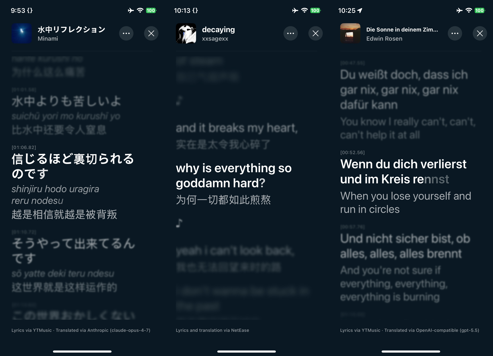
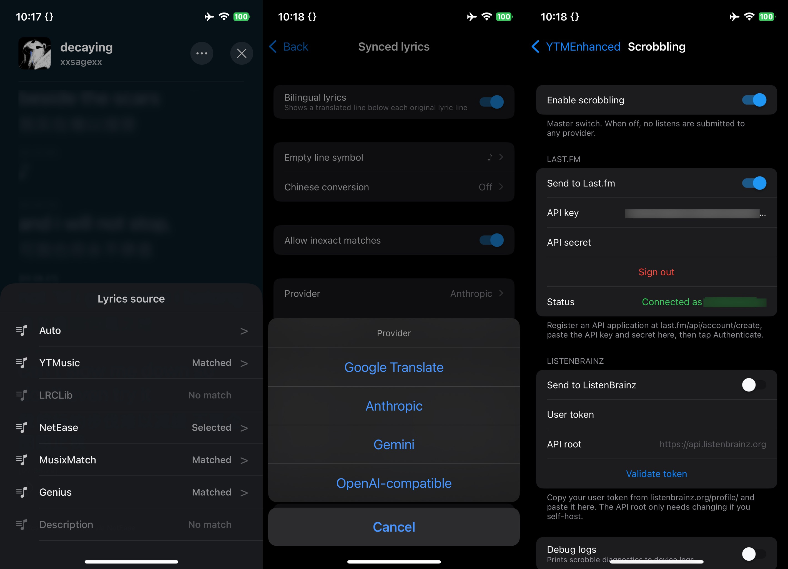

<h1 align="center">YTMEnhanced</h1>

<p align="center">
  
</p>
<p align="center">
  
</p>

## Features

- **Bilingual lyrics** — original and translation shown line by line, pulled from multiple lyrics sources automatically
- **Translation** — bring your own LLM key (Anthropic / Gemini / OpenAI-compatible) or use Google Translate
- **Scrobbling** — real-time Last.fm and ListenBrainz with an offline queue
- Plus the usual basics — ad removal, background playback, audio downloads, SponsorBlock, seek buttons, playback rate — via [YTMusicUltimate](https://github.com/ginsudev/YTMusicUltimate)

## Build

Sideloaded IPA (needs [Theos](https://theos.dev/) + [`cyan`](https://github.com/asdfzxcvbn/pyzule-rw)):

```sh
scripts/build_sideload_ipa.sh <decrypted_ytm.ipa>
```

Or build a `.deb` with `make clean package` (`ROOTLESS=1` / `ROOTHIDE=1` as needed). You supply your own decrypted YouTube Music `.ipa`.

## Acknowledgements

- [YTMusicUltimate](https://github.com/ginsudev/YTMusicUltimate) — the base tweak this is built on
- [SponsorBlock](https://sponsor.ajay.app/) — segment-skip data
- [LRCLIB](https://lrclib.net/), [NetEase Cloud Music](https://music.163.com/), [Genius](https://genius.com/), [Musixmatch](https://www.musixmatch.com/) — lyrics sources
- [Last.fm](https://last.fm/api/) · [ListenBrainz](https://listenbrainz.org/) — scrobbling
- [mobile-ffmpeg](https://github.com/tanersener/mobile-ffmpeg), [MBProgressHUD](https://github.com/jdg/MBProgressHUD) — bundled libraries

## License

GPL-3.0. See [LICENSE](LICENSE).

Not affiliated with YouTube or Google LLC. "YouTube" and "YouTube Music" are trademarks of Google LLC.
